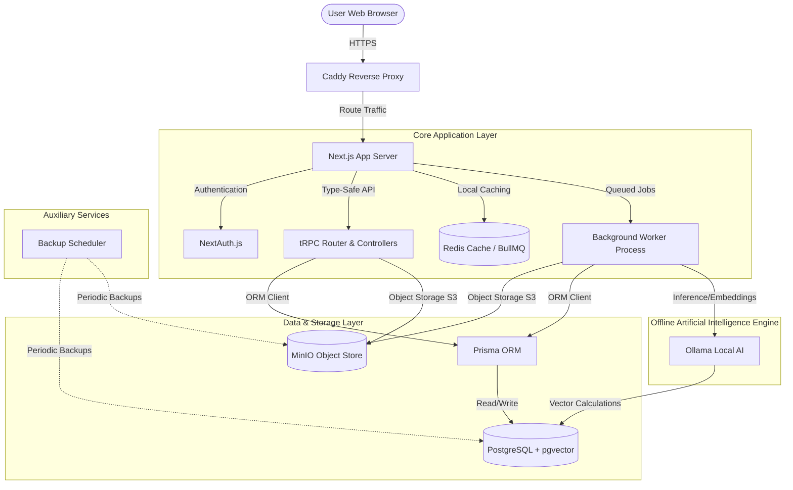
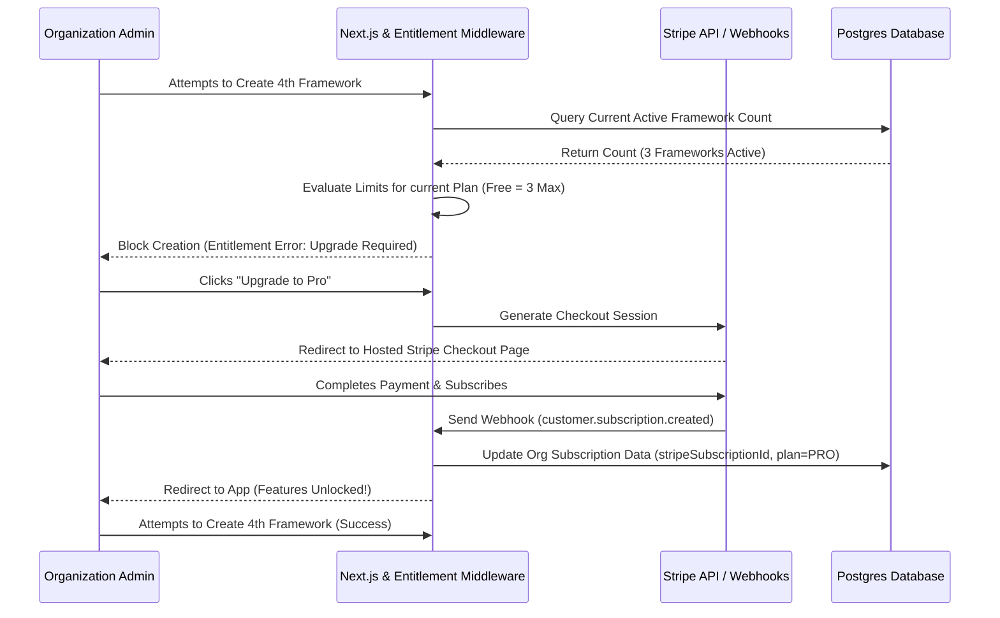
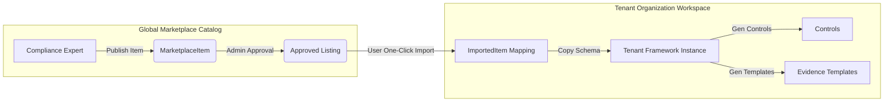
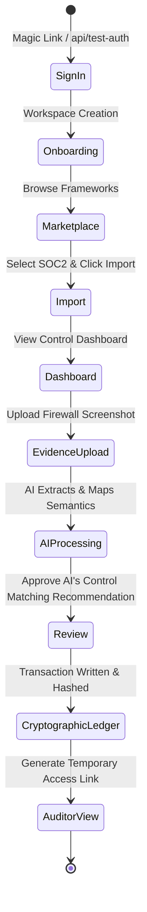

# Dharma – Self-Hosted Compliance Platform

Dharma is an enterprise-grade, self-hosted compliance management platform designed to automate security certifications (such as SOC 2, ISO 27001, and the DPDP Act 2023) completely on-premise or within your private cloud. By leveraging local Artificial Intelligence (AI) and vector search, Dharma enables organizations to map evidence, generate compliance policies, and manage multi-tenant compliance audits without leaking sensitive company data to public AI APIs or cloud SaaS vendors.

---

## 🎯 Problem Statement & Core Value Proposition

### The Problem
For modern businesses—particularly startups, MSMEs, and security-conscious enterprises—achieving and maintaining compliance certifications is a broken, costly, and risky process:
1. **Data Sovereignty & Privacy Risks:** Modern compliance automation platforms rely heavily on public cloud AI APIs (like OpenAI or Google Cloud). Uploading sensitive company data—such as network diagrams, employee handbooks, database logs, and firewall configurations—violates privacy guidelines and presents data leakage risks.
2. **Exorbitant SaaS & Consulting Costs:** Existing compliance platforms charge thousands of dollars annually, locked behind rigid tiers. Small-to-medium enterprises are forced to pay for external consultants just to navigate these tools.
3. **Manual Verification Bottlenecks:** Collecting evidence and manually matching files to hundreds of control points is time-consuming and prone to human error.
4. **Audit Log Vulnerability:** Standard relational databases are vulnerable to internal manipulation. A rogue administrator or attacker can alter compliance logs to hide breaches or gaps, ruining audit integrity.

### What is Dharma?
Dharma solves these problems by providing an open-source, self-hosted compliance platform that runs **entirely local AI models**. 
* **Zero-Cloud AI:** All document understanding, text extraction, and control mapping are performed offline via a local Ollama instance running open-source models.
* **Tamper-Evident Ledger:** Evidence chains are cryptographically linked using a blockchain-like hashing mechanism. If any record is modified, the signature chain breaks immediately.
* **SaaS Billing & Entitlements Built-In:** Designed to support multi-tenant workspaces, offering subscription tiers (Free, Pro, Enterprise) integrated with Stripe, self-service portals, and automated resource gating.
* **Integrated Marketplace:** Allows users to discover, publish, review, and import compliance frameworks and controls instantly.

---

## 🏗️ Detailed Architecture & System Design

Dharma is built on a robust, decoupled multi-container architecture. Below is the system design diagram mapping the core services, network flows, and datastores.

### System Components Diagram


### Component Details
1. **Next.js (Web Server & UI):** Houses both the React frontend and the Node.js API routes. Frontend styling is built using Tailwind CSS and Radix UI primitives. Type safety is maintained end-to-end via tRPC.
2. **PostgreSQL & pgvector:** The main database. `pgvector` stores high-dimensional embeddings generated by local AI models, enabling semantic search and matching of evidence files to control descriptions.
3. **MinIO Object Store:** An S3-compatible local object storage server that hosts uploaded PDF policies, screenshots, and system configuration backups.
4. **BullMQ & Redis:** Handles asynchronous background processing (e.g., parsing large PDFs, calling the local LLM, indexing files, and generating backup tarballs).
5. **Ollama:** Serves local LLMs (e.g., Llama 3) and embedding models (e.g., Nomic Embed Text) completely offline, utilizing host CPU/GPU resources.
6. **Caddy:** Serves as the lightweight edge reverse proxy handling TLS termination and routing.
7. **Backup Scheduler:** A separate service executing cron-like schedules that backups PostgreSQL data and MinIO files, archiving them securely on a mount.

---

## 🔒 Multi-Tenancy, Billing, & Entitlement Gating

Dharma implements a secure, isolated multi-tenant design that supports organic scaling and self-service administration:



### 1. Entitlements Gating System
All write actions and high-resource features are protected by an entitlement middleware. When a user requests a creation (e.g., adding an auditor, importing a framework, uploading evidence), the app queries the active limits associated with the Organization's subscription plan.

* **Free Plan:** Limited to 5 Users, 3 Frameworks, and 100 MB Evidence storage. No advanced AI Advisor or SSO capability.
* **Pro Plan:** Up to 20 Users, 10 Frameworks, 1 GB Storage. Access to standard AI Advice.
* **Enterprise Plan:** Unlimited Users, Frameworks, and Storage. Includes SSO, priority support, and advanced AI mapping.

These limits are not hardcoded in the application layers. They are defined in the `Plan` model inside the database (limits JSON) and looked up dynamically via `EntitlementService.checkUsageLimit`.

---

## 🛒 Marketplace & Framework Import Workflow

The Marketplace is the catalog system that allows compliance teams to publish, share, rate, and pull templates directly into their isolated tenant configurations.



### How the Import Engine Works
1. **Validation & Entitlement Check:** Before importing, the system verifies that the organization's plan supports adding another framework and checks for prior imports to avoid duplicate instances.
2. **Schema Copying:** An isolated transaction copies the `MarketplaceItem`'s structure (including its controls, mapping relationships, and evidence requirements) into a tenant-specific `Framework` record linked directly to the importing Organization's ID.
3. **Tracking & Updates:** An `ImportedItem` record links the newly created workspace framework to the global marketplace listing. If a compliance expert updates a framework (e.g., ISO 27001 publishes a new control version), the admin settings panel alerts the tenant, offering a clean merge-update option.
4. **Unimport (Soft Rollback):** Tenants can safely unimport frameworks. This deletes all copied controls and metadata while preserving user-uploaded files on MinIO.

---

## 🚶 App Flow: The User Journey

Here is the operational workflow of a compliance manager using Dharma:



### Operational Steps
1. **Authentication:** The user logs in via email Magic Link. In local testing environments, developers use `/api/test-auth` to automatically bypass email configuration, instantiate an admin account, and establish mock database schemas.
2. **Discover & Import:** The user browses the Marketplace, selects a compliance target (e.g., SOC 2 Type II), reviews author ratings, and clicks **Import**.
3. **Policy Design & Mapping:** The manager uses the AI Advisor to draft security policies locally. Policies are uploaded to MinIO.
4. **Asynchronous Processing:** BullMQ registers the upload, triggers the worker, parses text, requests Ollama embeddings, and records matching weights.
5. **Approval & Ledger Commit:** The manager reviews the matching proposal (e.g., "Policy 1.2 meets Control CC1.1"). Clicking **Approve** locks the record into the cryptographically chained database.
6. **Audit Execution:** The company grants access to an external auditor via a secure, read-only interface. The auditor verifies evidence hashes directly against the DB registry.

---

## 🛠️ Complete Local Setup Guide

Follow these steps to run Dharma on your local machine using Docker.

### System Prerequisites
Ensure you have the following installed:
*   [Git](https://git-scm.com/)
*   [Docker & Docker Compose](https://www.docker.com/) (Ensure the daemon is running)
*   [Node.js](https://nodejs.org/) (Version >= 18.18.0)

### 1. Repository Setup
Clone the codebase and navigate to the directory:
```bash
git clone https://github.com/securitywithhem/Dharma.git
cd Dharma
```

### 2. Environment Variables Configuration
Config files for various setups are stored in `envs/`. The primary development config is at `envs/.env.development`.
For Docker setup, check the values inside `envs/.env.docker`.

### 3. Spin Up Containers
Use our standard npm wrapper script to initialize and build the Docker multi-container environment:
```bash
# Create backups directory to avoid mount failures
mkdir -p backups

# Boot all database, storage, Redis, and Ollama services
npm run docker:up
```
*Note: This command spins up PostgreSQL, Redis, MinIO, Ollama, and a Next.js worker node. Ollama will automatically download models upon initialization.*

### 4. Database Setup & Seeding
Apply database migrations and populate the platform with default plans and templates:
```bash
# Sync database schema changes
npx dotenv-cli -e envs/.env.development -- npx prisma db push --schema packages/db/schema.prisma --accept-data-loss

# Seed all core configurations (plans, frameworks, evidence templates)
npm run seed:all
```

### 5. Accessing & Authenticating the App
The application server will listen locally at:
*   **Web Portal:** [http://localhost:3000](http://localhost:3000)

#### Quick Development Login
To bypass SMTP setup during local testing, open your browser and navigate directly to:
👉 **[http://localhost:3000/api/test-auth](http://localhost:3000/api/test-auth)**

This logs you in as an administrative user with pre-configured templates and mock workspaces ready for evaluation.

---

## 🗄️ Backup, Monitoring & Disaster Recovery

Dharma provides built-in tools for maintaining self-hosted data durability.

### Automated Cron Backups
A dedicated scheduler container performs daily tar archives of PostgreSQL dumps and MinIO storage paths. Backups are saved inside the `/backups` directory in the root of the workspace.

You can trigger a backup instantly by running:
```bash
docker exec dharma-backup-scheduler /scripts/backup-all.sh
```

### System Performance Monitoring
To enable system health dashboards (Prometheus, Grafana, and Cadvisor profiles):
```bash
docker compose --env-file envs/.env.docker --profile monitoring up -d
```
You can access performance metric visualizations at `http://localhost:3001`.

---

## 🛡️ Reliability & Security Implementations

* **Cryptographic Signatures:** Every evidence upload record generates a SHA-256 hash incorporating the file payload, timestamps, and the previous ledger hash.
* **Deterministic Locking:** Database writes bound to auditing procedures run under PostgreSQL advisory locks, neutralizing race conditions during high-volume evidence submissions.
* **Failure Resilient Workers:** BullMQ workers monitor local Ollama availability. If Ollama times out during inference due to CPU load, jobs are automatically retried using exponential backoff instead of failing silently.
